## Overview

This is the final report for my Google Summer of Code 2020 project with Boost.Multiprecision.  The aim of the project was to ensure that core arithmetic functions are efficient for numbers of up to 10K digits. This encompassed:

* implementation, testing and benchmarking of the:
  * square root function, 
  * k-th root function (where k is an integer),
  * logarithm function,
  * several algorithms for computing digits of .
* testing the implementation of existing basic arithmetic operations

I implemented the following algorithms (more specific links to my implementations are also given at the subtitle of each section):

* For the square root function, I implemented [Newton-Raphson iteration](https://github.com/BoostGSoC20/multiprecision/blob/develop/include/boost/multiprecision/detail/default_ops.hpp#L1756) and [Karatsuba square root](https://github.com/BoostGSoC20/multiprecision/blob/develop/include/boost/multiprecision/detail/default_ops.hpp#L1663). The performance (and correctness) [tests](https://github.com/BoostGSoC20/multiprecision/blob/develop/example/sqrt_snips.cpp) indicated that Karatsuba square root implementation is >20x faster than the existing implementation at 10K digits.
* For the k-th root function, I implemented the [Newton-Raphson iteration](https://github.com/BoostGSoC20/multiprecision/blob/develop/include/boost/multiprecision/detail/default_ops.hpp#L1985), where performance (and correctness) [tests](https://github.com/BoostGSoC20/multiprecision/blob/develop/example/kth_root_snips.cpp) showed that it is >300x faster than the power-based implementation for small (<1K) integer values at 10K digits.
* For the log function, I implemented the [log AGM](https://github.com/BoostGSoC20/multiprecision/blob/develop/include/boost/multiprecision/detail/functions/pow.hpp#L418) method, where [performance tests](https://github.com/BoostGSoC20/multiprecision/blob/develop/example/log_snips.cpp) (and [correctness tests](https://github.com/BoostGSoC20/multiprecision/blob/develop/example/test_log_agm.cpp)) showed that it is >30x faster than the existing implementation at 10K digits.
* For pi computation, I implemented several algorithms ( [GL Un](https://github.com/BoostGSoC20/multiprecision/blob/develop/example/pi_millions_with_boost_multiprecision.cpp#L87), [Cub Un](https://github.com/BoostGSoC20/multiprecision/blob/develop/example/pi_millions_with_boost_multiprecision.cpp#L142), [GL](https://github.com/BoostGSoC20/multiprecision/blob/develop/example/pi_millions_with_boost_multiprecision.cpp#L381), [Qd](https://github.com/BoostGSoC20/multiprecision/blob/develop/example/pi_millions_with_boost_multiprecision.cpp#L196), [Cub](https://github.com/BoostGSoC20/multiprecision/blob/develop/example/pi_millions_with_boost_multiprecision.cpp#L228), [Qr](https://github.com/BoostGSoC20/multiprecision/blob/develop/example/pi_millions_with_boost_multiprecision.cpp#L258), [Qn](https://github.com/BoostGSoC20/multiprecision/blob/develop/example/pi_millions_with_boost_multiprecision.cpp#L288), [Non](https://github.com/BoostGSoC20/multiprecision/blob/develop/example/pi_millions_with_boost_multiprecision.cpp#L324) ) with the trivial [tests](https://github.com/BoostGSoC20/multiprecision/blob/develop/example/pi_millions_with_boost_multiprecision.cpp#L417).

The above implementations turned out to be quite efficient for up to tens of thousands (and even more) of digits. 

In case the math does not display well, you can download this report [here](https://github.com/BoostGSoC20/multiprecision/tree/develop/gsoc_writeup/main.pdf).

## SQRT implementation

*code*: [Newton-Raphson iteration](https://github.com/BoostGSoC20/multiprecision/blob/develop/include/boost/multiprecision/detail/default_ops.hpp#L1756), [Karatsuba square root](https://github.com/BoostGSoC20/multiprecision/blob/develop/include/boost/multiprecision/detail/default_ops.hpp#L1663), [tests](https://github.com/BoostGSoC20/multiprecision/blob/develop/example/sqrt_snips.cpp)

The square root function is one of the most commonly used mathematical functions either as a standalone function or as a component of more complicated ones (see  and  computations, below).

### Implementations

The existing implementation for floating point numbers converts the number to an integer and then performs the square root operation in the integer space. To recover the square root of the floating point number, only the exponent needs to be adjusted. This is why the descriptions of the algorithms below focus on computing the square root of an integer.  

**Existing implementation:** The current implementation of the sqrt function uses the binary method which operates in two phases:

1. Using binary search find the largest power of two  whose square is smaller than the given number.
2. Go through the bits  to  and decide whether it should be a  or a , by checking if , where  is the suffix of the square calculated up to i.

The second check can be performed using just additions, so each iteration requires just additions. So, the computation requires additions linear to the number of precision bits.

**Newton-Raphson's method:** Newton's method is an iterative method which can be used to find a root of a (sufficiently smooth, see below) function :

1. Choose an initial point .
2. Set .
3. Repeat step (2) until two iterates  and  are sufficiently close (smaller than epsilon, the precision of the representation).

By choosing ,  has its only positive root at . The Newton-Raphson iteration becomes:

   

For quadratic convergence, the initial value has to be within twice of the square root. For a value , a good initial value is , which can be calculated efficiently by right shifting the number.

The implementation for Newton Raphson's method can be found [here](https://github.com/BoostGSoC20/multiprecision/blob/develop/include/boost/multiprecision/detail/default_ops.hpp#L1756).

In theory, for a good initial value, the convergence rate is quadratic. However, in practice, the algorithm has several calls to the division subroutine, making the execution slower.

**Karatsuba square root:**

The Karatsuba square root method is a method that recursively computes the square root for the upper half of the digits and uses the division algorithm (and the lower half of the digits) to compute the square root of the entire number (see Algorithm 1). It is named like this due to its similarity with Karatsuba's multiplication algorithm that also splits the digits into four parts. The pseudocode for the algorithm (based on (Zimmerman 1998) and (Brent and Zimmerman 2010)) is given below:

   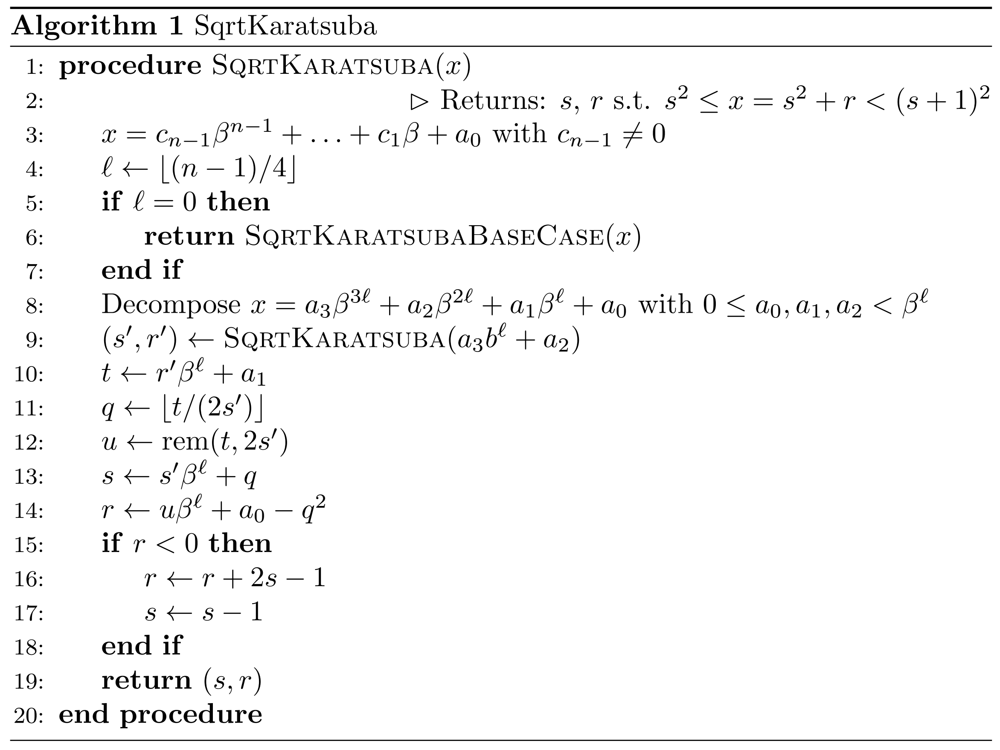

The implementation of the core part can be found [here](https://github.com/BoostGSoC20/multiprecision/blob/develop/include/boost/multiprecision/detail/default_ops.hpp#L1663).

The other part which is not covered in the algorithm descriptions is how to solve the base case. The problem here is that we will be left with four (because of line 5) 32-bit limbs and there is no built-in method to compute the square root of 128-bit integers. Continuing the splitting at the bit level at non-fixed positions will be tedious and not very efficient. However, I noticed that it is possible instead to handle all cases as one of the following four:

   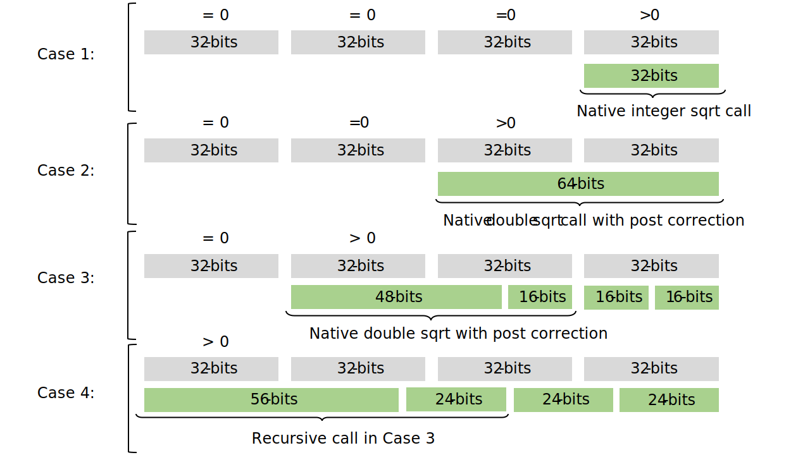

The second case relies on the fact that we can fix the rounding problems in double sqrt for 64-bit integers (see [code](https://github.com/BoostGSoC20/multiprecision/blob/develop/include/boost/multiprecision/detail/default_ops.hpp#L1554)). The third case splits into 32-bit integers which means that the recursive call can be handled by Case 2 (see [code](https://github.com/BoostGSoC20/multiprecision/blob/develop/include/boost/multiprecision/detail/default_ops.hpp#L1595)). The fourth case splits into 64-bit integers which means that the recursive call can be handled by Case 3 (see [code](https://github.com/BoostGSoC20/multiprecision/blob/develop/include/boost/multiprecision/detail/default_ops.hpp#L1628)).

### Correctness tests

The following correctness tests (see [here](https://github.com/BoostGSoC20/multiprecision/blob/develop/example/sqrt_snips.cpp)) were run for each of the implementations:

* A number of randomly chosen values in :
  * with some of which the response was compared to hardcoded values from Wolfram Alpha.
  * with some of which the response was verified using the following integer square root check (requiring only multiplications):  is the square of iff  and . 
* A number of edge cases (containing , , powers of two)
* A number of cases that are difficult for specific algorithms: 
  * powers of two,
  * powers of two minus one,
  * numbers with different 1, 2, 3 or 4 limbs.
  * all possible squares of numbers in  (must enable `EXHAUSTIVE_TESTS`),
  * for all numbers in  (these trigger the greatest possible remainder).

### Performance tests

The tests where performed on the same 20 randomly sampled numbers. The error bars represent confidence intervals at 95% assuming each trial is i.i.d.

   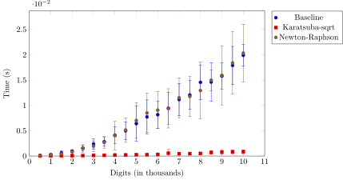

As an extension we show that Karatsuba square root is efficient for up to 100K (and even more).

   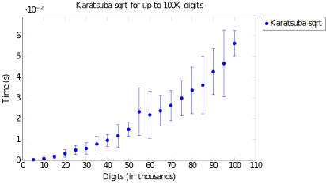

## k-th root implementation

*code:* [Newton-Raphson](https://github.com/BoostGSoC20/multiprecision/blob/develop/include/boost/multiprecision/detail/default_ops.hpp#L1985) and [tests](https://github.com/BoostGSoC20/multiprecision/blob/develop/example/kth_root_snips.cpp)

Some of the  algorithms require taking the fourth or fifth root of a number. The general case for this is taking the -th integer root of a number . The current way of doing this in Boost.Multiprecision is through  which is not very efficient for small integer .

**Newton-Raphson method:** Similarly to the Newton-Raphson implementation of the square root, we define, whose derivative isand which gives the iteration method,

    

### Performance tests

Comparing with the existing implementation, the new implementation is 300x faster for 10K digits,

    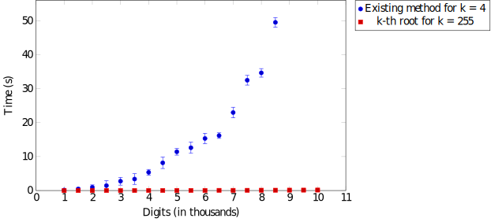

See below the performance for various values of k,

    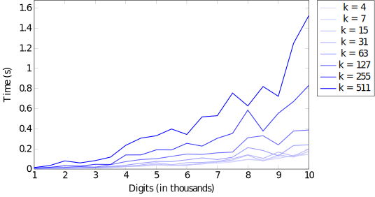

As an extension, the performance tests for up to 100K digits, show that the implementation is efficient for an even wider range of values.

    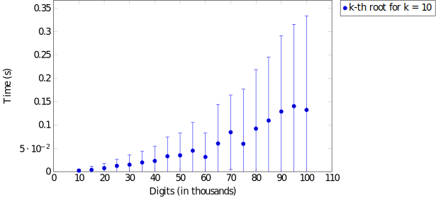

## Log implementation

*code:* [log AGM](https://github.com/BoostGSoC20/multiprecision/blob/develop/include/boost/multiprecision/detail/functions/pow.hpp#L418), [correctness tests](https://github.com/BoostGSoC20/multiprecision/blob/develop/example/test_log_agm.cpp) and [performance tests](https://github.com/BoostGSoC20/multiprecision/blob/develop/example/log_snips.cpp)

### Implementations

**Existing implementation:** The existing implementation computes , by writing  as  and setting . Then . The constant  is hardcoded and  is computed using Maclaurin series: 

    

**AGM-based:** Gauss introduced the arithmetic-geometric method (AGM), where two initial values  and  are chosen and 

   

For any initial values with , the sequence converges to a finite value by Bolzanno-Weirstrass as . 

Gauss proved that a sequence with  and  converges to , where 

   

The elliptic function  satisfies . Hence, one can evaluate  to  digits of precision using

   

where . This algorithm has  operational complexity and , where  is the time complexity of multiplication. The implementation is based on the description in (Borwein and Borwein, 1987) and Section 7.5.2 in (Muller 2006)

### Correctness tests

The following correctness tests were run (see [here](https://github.com/BoostGSoC20/multiprecision/blob/develop/example/test_log_agm.cpp)):

 * Tests of extreme values (infinity, zero)
 * Tests of edge cases (1, e)
 * Tests for various pseudo-random values.
 * Stress tests by comparing the log() of 50 random values with the output of MPFR.
 * Tests for different ranges: close to zero, just below 1/2, just above 1/2, just below 1, just above 1

### Performance tests

The tests where performed on the same 20 randomly sampled numbers. The error bars represent confidence intervals at 95% assuming each trial is i.i.d.

   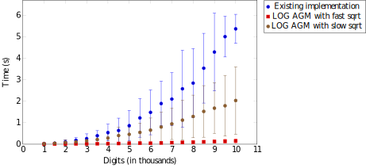

For more emphasis on the newly implemented method using the log AGM function:

   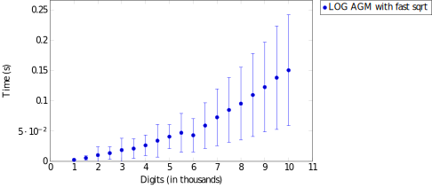

As an extension we show that the log AGM implementation performance for up to 100K.

    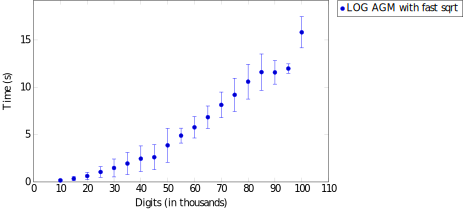

## PI algorithms

*code:* pi algorithms ( [GL Un](https://github.com/BoostGSoC20/multiprecision/blob/develop/example/pi_millions_with_boost_multiprecision.cpp#L87), [Cub Un](https://github.com/BoostGSoC20/multiprecision/blob/develop/example/pi_millions_with_boost_multiprecision.cpp#L142), [GL](https://github.com/BoostGSoC20/multiprecision/blob/develop/example/pi_millions_with_boost_multiprecision.cpp#L381), [Qd](https://github.com/BoostGSoC20/multiprecision/blob/develop/example/pi_millions_with_boost_multiprecision.cpp#L196), [Cub](https://github.com/BoostGSoC20/multiprecision/blob/develop/example/pi_millions_with_boost_multiprecision.cpp#L228), [Qr](https://github.com/BoostGSoC20/multiprecision/blob/develop/example/pi_millions_with_boost_multiprecision.cpp#L258), [Qn](https://github.com/BoostGSoC20/multiprecision/blob/develop/example/pi_millions_with_boost_multiprecision.cpp#L288), [Non](https://github.com/BoostGSoC20/multiprecision/blob/develop/example/pi_millions_with_boost_multiprecision.cpp#L324) ) and [tests](https://github.com/BoostGSoC20/multiprecision/blob/develop/example/pi_millions_with_boost_multiprecision.cpp#L417)

### Implementations

**Existing implementation:** The existing implementation simply has a hardcoded value for pi. 

**New implementations:** We added the Gauss-Legendre algorithm and some of the variants introduced by the Borwein brothers:

* Gauss-Legendre (GL Un), with implementation based on Algorithm 16.148 of (Arndt and Haenel, 2001) (mentor's implementation).
* Cubic Borwein (Cub Un) with implementation based on Algorithm 16.151 of (Arndt and Haenel, 2001) (mentor's implementation).
* Gauss-Legendre (GL) (the non-Schoenhage variant).
* Quadratic Borwein (Qd) (uses sqrt) based on Algorithm 2.1 on p.46 of (Borwein and Borwein, 1987).
* Cubic Borwein (Cub) basic implementation (uses cbrt method, so it is not expected to benefit from any of the improvements) based on p.47 of (Borwein et al. 1994).
* Quartic Borwein (Qr) (uses sqrt twice) based on Algorithm 5.3 on p.170 of (Borwein and Borwein 1987).
* Quintic Borwein (Qn) (uses 5-th root) based on (Borwein and Borwein, 1989).
* Nonic Borwein (Non) (uses cbrt) based on (Bailey et al. 1997).

### Correctness tests

The tests simply compared the digits with various publicly available collections of pi digits.

### Performance tests

Below is a table with the performance of each implementation on a set of digits. The shaded rows show the performance of the algorithms without the newest changes (efficient sqrt and kth-root). With the exception of cubic Borwein (which uses cbrt), all others show a significant improvement. The fastest method was Gauss-Legendre (with the Unleash Pi implementation). 

| Method/N | GL Un      | Cub Un     | GL          | Qd         | Cub        | Qr         | Qn          | Non        |
| -------- | ---------- | ---------- | ----------- | ---------- | ---------- | ---------- | ----------- | ---------- |
| 1K       | 0.003268s  | 0.003646s  | 0.000948s   | 0.002509s  | 0.003997s  | 0.001952s  | 0.012384s   | 0.006122s  |
|          | 0.017836s  | 0.004957s  | 0.009617s   | 0.008635s  | 0.004179s  | 0.013524s  | 0.208164s   | 0.005892s  |
| 5K       | 0.012640s  | 0.113406s  | 0.020494s   | 0.063762s  | 0.116883s  | 0.029694s  | 0.313708s   | 0.149207s  |
|          | 0.255039s  | 0.130431s  | 0.268763s   | 0.263724s  | 0.126375s  | 0.284409s  | 18.019207s  | 0.163338s  |
| 10K      | 0.047336s  | 0.473562s  | 0.064468s   | 0.298860s  | 0.433946s  | 0.096938s  | 1.32719s    | 0.548498s  |
|          | 1.094545s  | 0.517367s  | 1.091298s   | 0.969387s  | 0.485853s  | 1.050066s  | 155.949646s | 0.686482s  |
| 50K      | 1.075196s  | 10.947395s | 1.115937s   | 5.745923s  | 11.148762s | 2.091759s  | 41.4093s    | 15.325591s |
|          | 27.866652s | 13.622281s | 28.721098s  | 26.763367s | 12.883669s | 35.426968s |             | 17.174911s |
| 100K     | 3.919699s  |            | 4.652693s   | 26.834837s |            | 9.370837s  |             |            |
|          |            |            |             |            |            |            |             |            |
| 500K     | 97.616852s |            | 121.964401s |            |            |            |             |            |
|          |            |            |             |            |            |            |             |            |

Below, we show a more detailed plot of the performance of GS Un, against various digits up to 10K.

    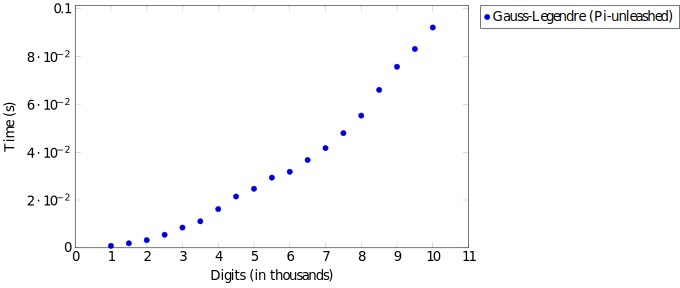

## VC builds for MPFR and MPIR

This GSoC work also created basic support for VC builds of MPIR and MPFR. The MPIR build is based on the original work of https://github.com/wbhart/mpir (GMP_VERSION version 6.0.0 and MSC_MPIR_VERSION 3.0.0). Instructions for building and running MPIR and MPFR with Boost are the following:

 1. Obtain a copy of [vsyasm](https://yasm.tortall.net/Download.html).
 2. Copy the file `yasm` to `C:\Program Files\yasm\`.
 3. Set a user variable `YASMPATH=<path to YASM assembler>` (e.g. `C:\Program Files\yasm\`).
 4. Ensure that path you have selected matches that in `example\mpfr_vc_and_mpir_vc\mpir_vc\yasm\vsyasm.props`.
 5. Supply a custom build rule to Visual Studio 2019:
    1. Identify a directory such as:
       `C:\Program Files (x86)\Microsoft Visual Studio\2019\Community\MSBuild\Microsoft\VC\v160\BuildCustomizations`
    2. Here, custom build rules reside in files with extensions ".props" and ".targets"
    3. Copy `vsyasm.props`, `vsyasm.targets` and `vsyasm.xml` to this directory, so that VS can find the custom rules for yasm.
 5. (Make sure that you have set `BOOST_ROOT` to the root directory of the Boost version you want to run).
 6. Open `example\mpfr_vc_and_mpir_vc\test_with_boost\test_with_boost.sln` ([here](https://github.com/BoostGSoC20/multiprecision/tree/develop/example/mpfr_vc_and_mpir_vc/test_with_boost)) and run.

## Future work:

 * Using Newton-Raphson method, we can compute the complex exponential function (see preliminary work: [code](https://github.com/BoostGSoC20/multiprecision/blob/develop/include/boost/multiprecision/complex_adaptor.hpp#L522) and [tests](https://github.com/BoostGSoC20/multiprecision/blob/develop/example/complex_exponential_snips.cpp)). In turn, this will give efficient implementations for sine and cosine.
 * The following functions could be optimised further: eval_msb, create a function that computes and returns both the remainder and the quotient.

## References

Arndt, Jörg, and Christoph Haenel. *Pi-unleashed*. Springer Science & Business Media, 2001.

Brent, Richard P., and Paul Zimmermann. *Modern computer arithmetic*. Vol. 18. Cambridge University Press, 2010, pp.26

Borwein, Jonathan M., and Peter B. Borwein. *Pi and the AGM: a study in the analytic number theory and computational complexity*. Wiley-Interscience, 1987.

Borwein, J.M.; Borwein, P.B. *Approximating pi with Ramanujan's solvable modular equations*. Rocky Mountain J. Math. 19 (1989), no. 1,

Borwein, Jonathan M., Peter B. Borwein, and Frank G. Garvan.  *Some cubic modular identities of Ramanujan.* Transactions  of the American Mathematical Society (1994): 35-47.

Muller, Jean-Michel. *Elementary functions: algorithms and implementations*. Birkhũser Boston, 2006.

Zimmermann, Paul. *Karatsuba Square Root*. [Research Report] RR-3805, INRIA. 1999, pp.8

